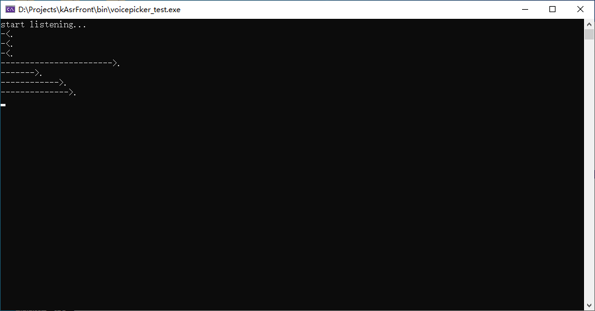

# kAsrFront

### 介绍
语音识别前端模块，实现语音自动拾取、分帧、预处理、加窗，以及常用特征生成。

### 特征提取
语音特征主要兼容kaldi和praat，其中与praat匹配度较好，与kaldi有一定误差（主要由于fft算法不同影响）

#### FFT特征
在测试用例上，输出结果与praat、fftw3一致，与kaldi平均相对偏差0.0036。

#### Spectrum特征
可输出power, log, db, mag等4种类型频谱，可设定兼容Pratt和kaldi的归一化。在测试用例上，输出结果与praat一致，与kaldi平均相对偏差0.000048。

#### Spectrogram特征
主要兼容kaldi。在测试用例上，与kaldi平均相对偏差0.000018。

#### Fbank特征
可在linear, log, mel, bark, erb等5种频域尺度上进行分析，兼容kaldi。在测试用例上，与kaldi平均相对偏差0.0016。

#### Mfcc特征
主要兼容kaldi。在测试用例上，与kaldi平均相对偏差0.2。偏差较大，原因暂未找到。

### 语音拾取
使用rtaudio库录音，使用基于webrtc的voixen-vad进行话音检测，实现片段语音自动拾取功能。测试程序界面如下：

